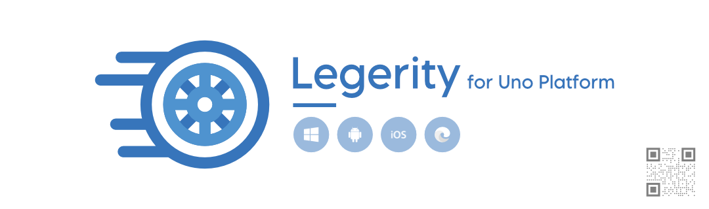

# Legerity for Uno Platform

Built on top of the [Legerity UI testing framework](https://github.com/MADE-Apps/legerity), this library is to be used with Android, iOS, and Web applications built with the Uno Platform (www.platform.uno) rendered cross-platform elements.

Legerity for Uno Platform provides the best experience for building maintainable UI automation with speed for Uno Platform applications.

## Support Legerity for Uno Platform♥

As many developers know, projects like Legerity for Uno Platform are built and maintained in spare time. If you find this project useful, please **Star** the repo and if possible, sponsor the project development on GitHub. 

## Build Status

| Build | Status | Current Version |
| ------ | ------ | ------ |
| Packages |  |  |
| Docs |  | N/A |

## Installation 💾

Legerity for Uno is publicly available via NuGet. Each available package is detailed below.

| Package | Current | Preview |
| ------ | ------ | ------ |
| Legerity.Uno |  |  |

## Documentation 📃

If you want to deep dive into the Legerity for Uno library with details on how to use the features, you can browse the [documentation](https://made-apps.github.io/legerity-uno/) for help getting up and running!

## Contributing 🚀

Looking to help build Legerity for Uno Platform? Take a look through our [contribution guidelines](CONTRIBUTING.md). We actively encourage you to jump in and help with any issues!

## Building Legerity for Uno 🛠

Legerity for Uno is built using .NET Standard, taking advantage of the new SDK-style projects.

You can build the solution using Visual Studio with the following workloads installed:

- .NET desktop development
- .NET Core cross-platform development

## License

Legerity for Uno Platform is made available under the terms and conditions of the [MIT license](LICENSE).
