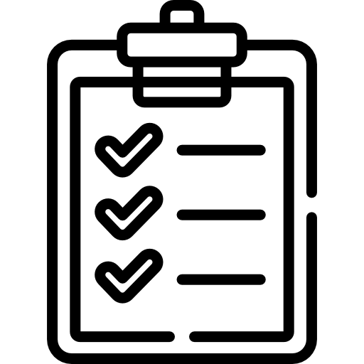

  <h1 class="hero-title">
    Write UI tests once, run everywhere for Uno Platform apps
  </h1>

  

    Legerity for Uno Platform is a framework for writing cross-platform UI tests that can be written once and run on Windows, WebAssembly, iOS, and Android
  

  

[Get Started](articles/intro.md)

  

  

    

      <h2 class="md-header">
        Element Wrappers
      </h2>
      

        Simplifying your UI tests by providing easy-to-use platform element wrappers for Uno Platform controls
      

  

[Discover More](articles/intro.md)

  

    

  

  

    

      
    

  

  

    

      
    

  

  

    

      <h2 class="md-header">
        Page Object Pattern
      </h2>
      

        Bringing maintainability and code reuse to your UI tests with the page object pattern
      

  

[Discover More](articles/intro.md)

  

    

  

  

    

      <h2 class="md-header">
        Bring Your Favorite Test Framework
      </h2>
      

        Legerity is agnostic of .NET testing frameworks. So whether you're an NUnit, xUnit, or MSTest fan, you can work with what you know
      

  

[Discover More](articles/intro.md)

  

    

  

  

    

      
    

  

  

    

      
    

  

  

    

      <h2 class="md-header">
        Extendable By Default
      </h2>
      

        Legerity for Uno Platform provides the building blocks to write element wrappers for your own custom controls
      

  

[Discover More](articles/intro.md)

  

    

  

---

  

    

      
      <h2 class="sm-header">
        Support Legerity for Uno Platform
      </h2>
      

        If you'd like to support Legerity for Uno Platform, considering sponsoring the project
      

      
<a aria-label="Support Legerity for Uno Platform" target="_top" href="https://github.com/sponsors/jamesmcroft/">
<svg height="16" class="octicon octicon-heart text-pink me-2" viewbox="0 0 16 16" version="1.1" width="16" aria-hidden="true">
<path fill-rule="evenodd" d="M4.25 2.5c-1.336 0-2.75 1.164-2.75 3 0 2.15 1.58 4.144 3.365 5.682A20.565 20.565 0 008 13.393a20.561 20.561 0 003.135-2.211C12.92 9.644 14.5 7.65 14.5 5.5c0-1.836-1.414-3-2.75-3-1.373 0-2.609.986-3.029 2.456a.75.75 0 01-1.442 0C6.859 3.486 5.623 2.5 4.25 2.5zM8 14.25l-.345.666-.002-.001-.006-.003-.018-.01a7.643 7.643 0 01-.31-.17 22.075 22.075 0 01-3.434-2.414C2.045 10.731 0 8.35 0 5.5 0 2.836 2.086 1 4.25 1 5.797 1 7.153 1.802 8 3.02 8.847 1.802 10.203 1 11.75 1 13.914 1 16 2.836 16 5.5c0 2.85-2.045 5.231-3.885 6.818a22.08 22.08 0 01-3.744 2.584l-.018.01-.006.003h-.002L8 14.25zm0 0l.345.666a.752.752 0 01-.69 0L8 14.25z"></path>
</svg>
Support Us
</a>

    

  

  

    

      
      <h2 class="sm-header">
        Contribute on GitHub
      </h2>
      

        Legerity for Uno Platform is open source and you can contribute on GitHub
      

      
<a aria-label="Contribute to Legerity for Uno Platform" target="_top" href="https://github.com/MADE-Apps/Legerity-Uno/">
<svg height="16" class="octicon octicon-heart text-pink me-2" viewbox="0 0 16 16" version="1.1" width="16" aria-hidden="true">
<path fill-rule="evenodd" d="M4.25 2.5c-1.336 0-2.75 1.164-2.75 3 0 2.15 1.58 4.144 3.365 5.682A20.565 20.565 0 008 13.393a20.561 20.561 0 003.135-2.211C12.92 9.644 14.5 7.65 14.5 5.5c0-1.836-1.414-3-2.75-3-1.373 0-2.609.986-3.029 2.456a.75.75 0 01-1.442 0C6.859 3.486 5.623 2.5 4.25 2.5zM8 14.25l-.345.666-.002-.001-.006-.003-.018-.01a7.643 7.643 0 01-.31-.17 22.075 22.075 0 01-3.434-2.414C2.045 10.731 0 8.35 0 5.5 0 2.836 2.086 1 4.25 1 5.797 1 7.153 1.802 8 3.02 8.847 1.802 10.203 1 11.75 1 13.914 1 16 2.836 16 5.5c0 2.85-2.045 5.231-3.885 6.818a22.08 22.08 0 01-3.744 2.584l-.018.01-.006.003h-.002L8 14.25zm0 0l.345.666a.752.752 0 01-.69 0L8 14.25z"></path>
</svg>
Contribute
</a>
    

  

